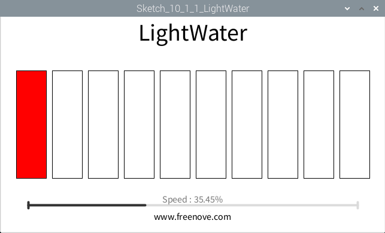
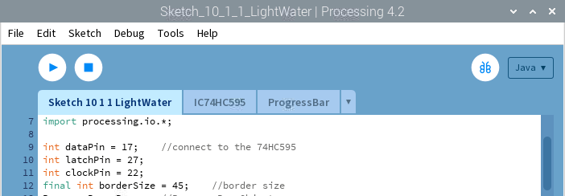

################################################################
Chapter 74HC595 & LED Bar Graph
################################################################

.. include:: ../common/com.74HC595 & Bar Graph LED.rst

Sketch
================================================================

Sketch 10.1.1 LightWater
----------------------------------------------------------------

First, observe the result after running the sketch, and then learn about the code in detail.
1.	Use Processing to open the file Sketch_10_1_1_LightWater.

.. code-block:: console    
    
    $ processing ~/Freenove_Kit/Processing/Sketches/Sketch_10_1_1_LightWater/Sketch_10_1_1_LightWater.pde

2.	Click on "RUN" to run the code.

After the program is executed, Display Window shows a virtual LED Bar Graph, which will bright at the same rate and in the same way as the LED Bar Graph in the circuit. Dragging the progress bar can adjust the flow rate of light water.

This project contains a lot of code files, and the core code is contained in the file Sketch_10_1_1_LightWater. The other files only contain some custom classes.

