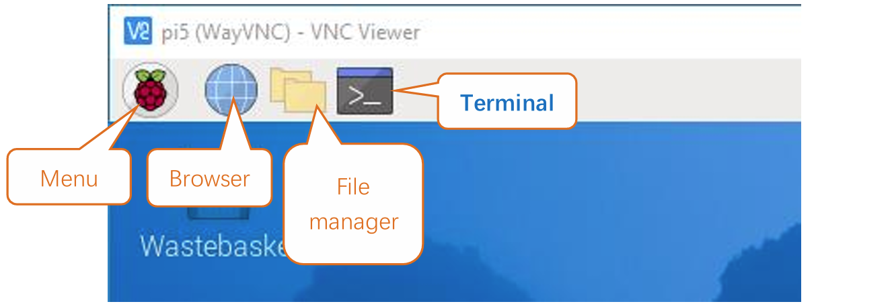
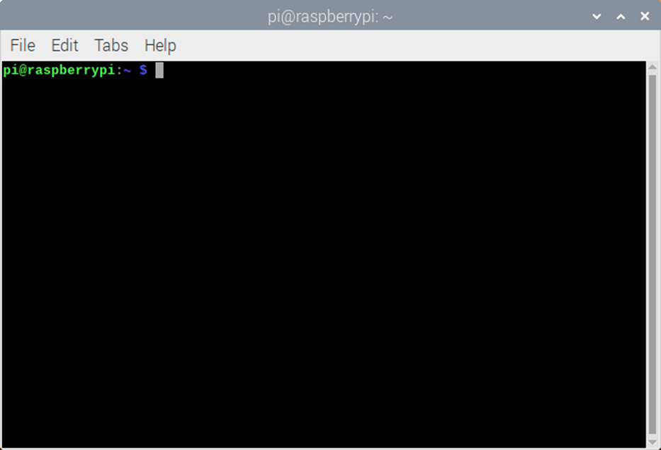
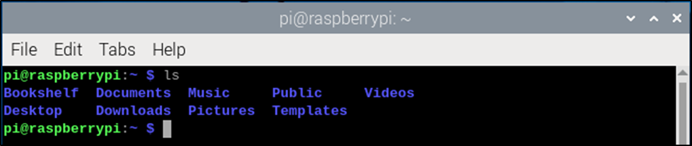
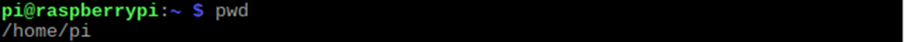
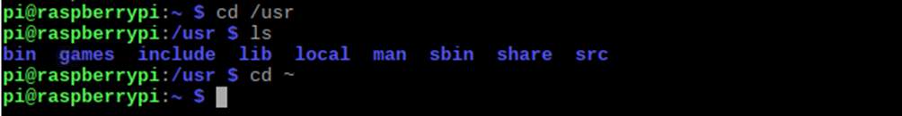
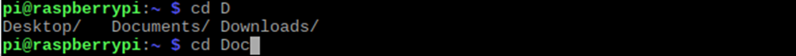
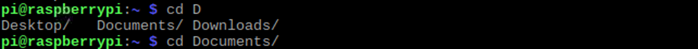

##############################################################################
0. Chapter Preparation
##############################################################################

Why “Chapter 0”? Because in program code the first number is 0. We choose to follow this rule. In this chapter, we will do some necessary foundational preparation work: Start your Raspberry Pi and install some necessary libraries. 

Linux Command
****************************************************************

 `Download the code  <https://github.com/Freenove/Freenove_Ultimate_Starter_Kit_for_Raspberry_Pi/archive/refs/heads/master.zip>`_ 

Raspberry Pi OS is based on the Linux Operation System. Now we will introduce you to some frequently used Linux commands and rules.

First, open the Terminal. All commands are executed in Terminal. 

When you click the Terminal icon, following interface appears.

**Note: The Linux is case sensitive.**

First, type ``ls`` into the Terminal and press the “Enter” key. The result is shown below:

The ``ls`` command lists information about the files (the current directory by default).

Content between ``$`` and ``pi@raspberrypi:`` is the current working path. ``~`` represents the user directory, which refers to ``/home/pi`` here. 

``cd`` is used to change directory. / represents the root directory. 

Later in this Tutorial, we will often change the working path. Typing commands under the wrong directory may cause errors and break the execution of further commands. 

Many frequently used commands and instructions can be found in the following reference table.
    
+---------------+--------------------------------------------------------------------------------------------------+
| Command       | instruction                                                                                      |
+===============+==================================================================================================+
| ls            | Lists information about the FILEs (the current directory by default) and entries alphabetically. |
+---------------+--------------------------------------------------------------------------------------------------+
| cd            | Changes directory                                                                                |
+---------------+--------------------------------------------------------------------------------------------------+
| sudo + cmd    | Executes cmd under root authority                                                                |
+---------------+--------------------------------------------------------------------------------------------------+
| ./            | Under current directory                                                                          |
+---------------+--------------------------------------------------------------------------------------------------+
| gcc           | GNU Compiler Collection                                                                          |
+---------------+--------------------------------------------------------------------------------------------------+
| git clone URL | Use git tool to clone the contents of specified repository, and URL in the repository address.   |
+---------------+--------------------------------------------------------------------------------------------------+

There are many commands, which will come later. 

.. seealso:: 
    For more details about commands. You can refer to:
    http://www.linux-commands-examples.com

Shortcut Key
================================================================
Now, we will introduce several commonly used shortcuts that are very useful in Terminal.

1. **Up and Down Arrow Keys:** Pressing “↑” (the Up key) will go backwards through the command history and pressing “↓” (the Down Key) will go forwards through the command history.

2. **Tab Key:** The Tab key can automatically complete the command/path you want to type. When there is only one eligible option, the command/path will be completely typed as soon as you press the Tab key even you only type one character of the command/path. 

As shown below, under the '~' directory, you enter the Documents directory with the “cd” command. After typing “cd D”, pressing the Tab key (there is no response), pressing the Tab key again then all the files/folders that begin with “D” will be listed. Continue to type the letters "oc" and then pressing the Tab key, the “Documents” is typed automatically.

Get the Project Code
****************************************************************

If you have not get the code. In the pi directory of the RPi terminal, enter the following commands to get.

.. code-block:: console

    $ cd
    $ git clone --depth 1 https://github.com/freenove/Freenove_Ultimate_Starter_Kit_for_Raspberry_Pi

(There is no need for a password. If you get some errors, please check your commands.)

After the download is completed, a new folder "Freenove_Ultimate_Starter_Kit_for_Raspberry_Pi" is generated, which contains all of the tutorials and required code.

:red:`This folder name seems a little too long. We can simply rename it by using the following command.`

.. code-block:: console

    $ mv Freenove_Ultimate_Starter_Kit_for_Raspberry_Pi/ Freenove_Kit/

"Freenove_Kit" is now the new and much shorter folder name.

.. seealso::
    
    If you have no experience with scratch, we suggest that you refer to this website for basic information and knowledge: https://scratch.mit.edu/projects/editor/?tutorial=getStarted

Install and Configure Scratch 3
****************************************************************

Installation Steps
================================================================

Open the **Menu**, click on **Preferences** > **Recommended Software** > **Programming** >, and then select **Scratch 3** and click on **Apply**

